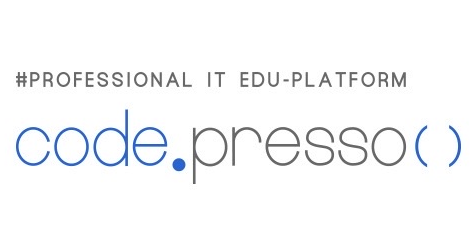

## cns-boot  
### Codepresso Simple SNS project for practice  
### 메인화면

---  
### 프로젝트 소개
트위터 같은 sns 프로젝트 입니다.
### 제작정보
codepresso 의 dev-ops 과정을 수강하면 작성한 프로젝트입니다.  
##### http://codepresso.kr/  
### 사용기술
* springboot  
* MyBatis  
* Freemarker  
### 필수조건 안내
* java 8 이상이 필요합니다.  
* STS 설치권장  
* Maven 기본설정 
* MySQL 5.7  
### 설치 안내 
클론을 통해서 받아서 사용하면 됩니다.  
주의할것은  src/main/resources/application.properies 파일을 보안상의 문제로 git 에는 업로드 하지 않았습니다.  
그래서 제가 사용한 기본값들을 올리니 사용자에 맞게 작성해 사용하면 됩니다.  
#프리마커 파일(.ftl)의 위치/확장자 지정
    spring.freemarker.template-loader-path: classpath:/templates/step3
	spring.freemarker.suffix: .ftl
    
    ## DataBase Connection 정보 설정
	spring.datasource.driver-class-name=com.mysql.cj.jdbc.Driver(사용자에 맞게 작성)
	spring.datasource.url=db-url (전 rds 사용) 
	spring.datasource.username=사용자
	spring.datasource.password=비밀번호
    
	# mapper 이하를 로깅 위치로 설정.
	logging.level.com.hellokoding.springboot.mybatis.mapper=TRACE
### 실행방법
* IDE를 통해 실행방법 - src/main/java/com/codepresso/CnsBootApplication.java 를 Run As Java Application 하면 됩니다.(내장톰캣을 사용)  
* .jar 로 만들어 실행방법  
   - 프로젝트를 마우스 우클릭 -> Run As -> 5. Maven Build 선택
   - Goals 에 package 입력
   - Profiles 에 입력되어 있는 pox.xml 삭제
   - run 클릭
   - 빌드가 완료되면 console 에 target dir의 위치가 표시된다.
   - cmd 를 통해 해당 위치로  접근한다.
   - java -jar <jar파일명.jar> 실행

    >java -jar cns-boot-0.0.1-SNAPSHOT.jar
   - 참고 블로그 : https://www.leafcats.com/178
* 
    

### 저작권
codepresso  

